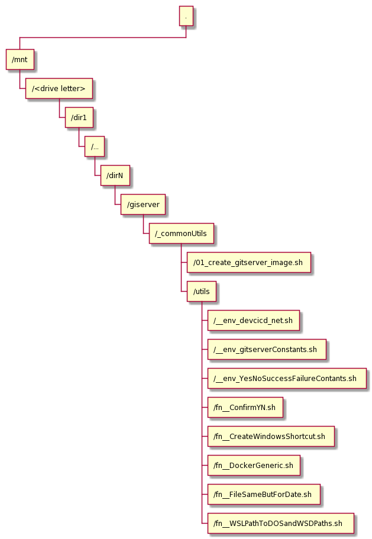

# 01_create_gitserver_image.sh

<!-- TOC -->

- [01_create_gitserver_image.sh](#01_create_gitserver_imagesh)
  - [1. Introduction](#1-introduction)
  - [2. Assumed host environment](#2-assumed-host-environment)
  - [3. Assumed execution environment](#3-assumed-execution-environment)
  - [4. Customisation](#4-customisation)
  - [5. Installation](#5-installation)
  - [6. Script invocation](#6-script-invocation)
  - [7. Bill of Materials (of sorts)](#7-bill-of-materials-of-sorts)
  - [8. High-level build logic](#8-high-level-build-logic)
  - [9. Dependencies](#9-dependencies)
  - [10. Licensing](#10-licensing)

<!-- /TOC -->

## 1. Introduction

This script facilitates creation of a Docker Image for a private GIT Server running as a Docker Container. The image uses the most recent GIT distribution (2.26 at the time of this writing). The container can be used to provide docker-network-wide Git repository for small to medium size teams workng on projects whose sources cannot or should not be stored in cloud-hosted Git repositories. Small to medium start-ups or small companies might be examples.

The image is based on [bitnami/minideb:jessie](https://github.com/bitnami/minideb) image as at 2020-04-29 or thereabouts.

Installing latest Git from sources, and pre-requisites for building Git from sources, blows the image up from about 51MB (`bitnami/minideb:jessie`) to about 778MB during the build process, and then shrinks it back to 238MB once the build is finished and build tools are removed.

The image is saved as the `gitserver:1.0.0` Docker Image and, if the user invokes the script with the correct argument, also uploaded to a remote docker repository, which must be defined (see later).

## 2. Assumed host environment

- Windows 10
- Windows Subsystem for Linux (WSL)
- Docker Desktop for Windows 2.2.0.5

The script (bash) expects to run within the Windows Subsystem for Linux (WSL) Debian host and have access to Windows' docker.exe and docker-compose.exe.

## 3. Assumed execution environment

The script expects directory structure like:

`/mnt/<drive letter>/dir1/../dirN/<projectNameDir>/_commonUtils/`

The script itself, **01_create_gitserver_image.sh**, is expected to be located in the **\_commonUtils** directory and to have that directory as its working directory at the time of invocation.

The script sources a number of utility sdcripts, located in its `utils` subdirectory

The script assumes that all projects-specific artefacts which it generates, except the docker image and the docker container, will be created in the parent directory of the **\_commonUtils** directory.

The name of the parent directory may be used as the basis for container name, as part of the Dockerfile and docker-container.yml names and in other places.
Choosing a good parent directory name is very important.
Parent name must consist of only alphanumeric charatcers.

<!--
from https://plantuml.com/wbs-diagram
@startwbs
+ .
 + /mnt
  + /<drive letter>
   + /dir1
    + /...
     + /dirN
      + /giserver
       + /_commonUtils
        + /01_create_gitserver_image.sh
        + /utils
         + /__env_devcicd_net.sh
         + /__env_gitserverConstants.sh
         + /__env_YesNoSuccessFailureContants.sh
         + /fn__ConfirmYN.sh
         + /fn__CreateWindowsShortcut.sh
         + /fn__DockerGeneric.sh
         + /fn__FileSameButForDate.sh
         + /fn__WSLPathToDOSandWSDPaths.sh
@endwbs
-->

The following diagram depicts the fictitious directory hierarchy and actual artifacts involved. The name <strong>gitserver</strong> is used as the name of the docker image, docker container and in a bunch of other artifacts. The <strong>utils</strong> directory contains common constant and function definitions, many of which are used in the main script.

<!--  -->

## 4. Customisation

Scripts `__env_devcicd_net.sh`, `fn__DockerGeneric.sh` and `__env_gitserverConstants.sh`, located in the <strong>utils</strong> subdirectory, contain all environment variables that may need to be reviewed and changed to implement site-specific customisations.

Relevant section of the `__env_devcicd_net.sh` is reproduced below. Values that can be changed are highlighted.

<code>
readonly __DEVCICD_NET_DC_INTERNAL=<strong>"devcicd_net"</strong> 
__DEVCICD_SUBNET_ADDRESS=<strong>"172.30.0.0/16"</strong> 
</code>

If the external docker network `docker_devcicd_net` does not exist, it will be created by this script.

Relevant bits of the `__env_gitserverConstants.sh` are reproduced below. Only change what you need to change from the standpoint of externally-visible names and numbers.

<code>
readonly _GIT_HOST_PPORT_=<strong>50022</strong> 
 
readonly __GITSERVER_NAME="<strong>gitserver</strong>" 
readonly __GITSERVER_HOST_NAME="<strong>gitserver</strong>" 
readonly __GITSERVER_CONTAINER_NAME="<strong>gitserver</strong>" 
</code>

The container runs the ssh server to provide remote access to the Git repositories. Port 22 in the container is exposed on port ${<strong>_GIT_HOST_PPORT_</strong>} of the docker host. Change that as required.

Script `fn__DockerGeneric.sh` contains the definition of the remote docker repository, which will have to be changed if you want to upload the image to a remote repository. If you run the script without arguments that would request remote repository upload then the scrip will skip the related logic and repository name will be ignored. If you need to, change the value of: 

<code>readonly __DOCKER_REPOSITORY_HOST=<strong>"my.docker.repository.net"</strong></code>

## 5. Installation

## 6. Script invocation

<code>cd /mnt/\<driver letter\>/dir1/../dirN/gitserver/\_commonUtils 
 
./01_create_gitserver_image.sh  
</code>
OR 
<code>
./01_create_gitserver_image.sh push|yes|p|y
</code>

The first variant (no argument or an argument starting with anything other than `Y`, `y`, `P` or `p` will NOT perform tagging and upload of the Docker Image `gitserver:1.0.0` to the configured remote Docker Repository.

The second variant (an argument starting with `Y`, `y`, `P` or `p`) will perform all actions including uploading the Docker Image `gitserver:1.0.0` to the configured remote Docker Repository.

Execution of this script will result in the Dockerfile being generated and used to create the Docker Image.

## 7. Bill of Materials (of sorts)

<ol>
<li><code>bitnami/minideb:jessie</code></li>
<li>See output of <code>docker image inspect gitserver</code> once the image is built or inspect the <code>Dockerfile.gitserver</code> in the parent of the _commonUtils directory to see what actually went on. 
<li>The build script adds the following to the <code>bitnami/minideb:jessie</code> image:</li>
<ol>
    <li><code>tzdata</code></li>
    <li><code>net-tools</code></li>
    <li><code>iputils-ping</code></li>
    <li><code>openssh-client</code></li>
    <li><code>openssh-server</code></li>
    <li><code>nano</code></li>
    <li><code>less</code></li>
</ol>
<li>The build script adds the following to enable git to be built from sources, then removes them once build is done:</li>
<ol>
    <li><code>wget</code></li>
    <li><code>unzip</code></li>
    <li><code>build-essential</code></li>
    <li><code>libssl-dev</code></li>
    <li><code>libcurl4-openssl-dev</code></li>
    <li><code>libexpat1-dev</code></li>
    <li><code>gettext</code></li>
</ol>
<li>Perhaps needless to say, the build process also adds:</li>
<ol>
    <li><code>git</code></li>
</ol>
</li>
</ol>

## 8. High-level build logic

1. Set environment variables
2. Create `docker-entrypoint.sh`
3. Create `Dockerfile`
4. if (ImageDoes not exist) OR (`Dockerfile` changed since last time) => Build the Docker Image using the `Dockerfile` from 3
5. if (container that uses the image exists) => stop AND/OR remove the container
6. Create and Start the container
7. Give non-root user's ownership of its home directory and resources
8. Create and deploy custom Git Shell commands (help, list, backup)
9. Commit continer changes to the image
10. Stop the container
11. Tag the image (DockerRemoteRepositoryName/ImageName:Version)
12. if (user requested push to remote docer repository) => Push the image to the defined remote docker repository

## 9. Dependencies

This script has hard dependencies on a number of constants and functions whose sources are in the `_commonUtils/utils` directory. Specifically:

1. \_\_env_devcicd_net.sh
2. \_\_env_gitserverConstants.sh
3. \_\_env_YesNoSuccessFailureContants.sh
4. fn\_\_WSLPathToDOSandWSDPaths.sh
5. fn\_\_ConfirmYN.sh
6. fn\_\_DockerGeneric.sh
7. fn\_\_FileSameButForDate.sh
8. fn\_\_CreateWindowsShortcut.sh

## 10. Licensing

The MIT License (MIT)

Copyright © 2020 Michael Czapski

If you would like me to consider working for you, or engage in specific projects for you, feel free to contact me.

Rights to Docker (and related), Git (and related), Debian, its pakages and libraries, and 3rd party packages and libraries, belong to their respective owners.
